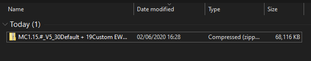

# Maiskorf's Additional Biome Pack \(Guide\)

This guide assists you in installing \(and configuring\) Maiskorf's Additional Biome Pack. If you are looking for a full installation guide using this pack, check [this](https://docs.dynamic-bytes.com/beginner/recommended-installation). If you have any issues with any of the steps in this process, make sure to contact our support team at [Discord](https://discord.gg/Jq3ecb3).

This tutorial is part of the [Recommended Installation](https://docs.dynamic-bytes.com/beginner/recommended-installation).

0. If you have not yet stopped your server, stop your server.

1. Download the [Maiskorf's Additional Biome Pack](https://1drv.ms/u/s!AmrRJ70wu8OUgZQbXJeaeZmp1FT41A?e=1Oejej).




> The link above takes you to a OneDrive download page. Click the `Download` button at the left top to download the file.


2. Unzip the pack using window's unzip


> If you do not see the `Extract` option at the top, make sure to click on the zip file.


3. Open the `MC1.15.#_V5_30Default + 19Custom EWG V8.1.25(1)` folder.


The `World Boimes map color.png` \(Boimes is typo-ed\) contains the colors you need to use [the Generate world from image](https://docs.dynamic-bytes.com/beginner/world-configuration/generate-world-from-image) feature.


4. Open the `World` folder.

5. Open the `paint_world` folder.

6. Copy the `settings` folder to your server `*/<world name>/settings`, replacing the folder already in there.

7. Go back to the `World` folder and open `plugins` folder.

8. Copy everything in this folder and paste it into your server


If you already have any of these plugins installed, you don't have to copy the `.jar` file for that plugin. Make sure to **always** replace the EpicWorldGenerator folder in your server, even though it is already in there. This contains the schematics for the world.


9. Continue with the [Recommended Installation](https://docs.dynamic-bytes.com/beginner/recommended-installation) or [Frequently Asked Questions](https://docs.dynamic-bytes.com/beginner/recommended-installation) if you came from either of these. If you did not, remove the `regions` folder which you can find in your `*/<world name>/regions`, and restart the server.

**Back to:** [**Table of contents**](https://docs.dynamic-bytes.com/table-of-contents)**.**

