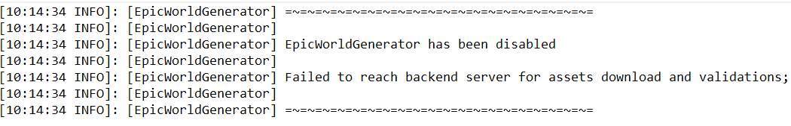

# Frequently Asked Questions

### Contents:

* I. Where do I find the configuration files?
* II. Where can I find pre-made configurations?
* III. Why do "chunk borders", missing chunks and/or weird transitions appear in my world?
* IV. Why are there no ores in my world?
* V. Why does my server not start?
  * V.I Issue with verification / back-end server
* VI. Why does my server randomly crash?
  * VI.I Issue with moisture
  * VI.II Issue with missing structure\(s\)
* VII. How do I pre-generate a world?
* VIII. How do I disable biomes I don't like?
* IIX. Can I remove the plugin after I generated a map?
* IX. Why are their weird half-black chunks on my \(Dyn\)map?
* X. Why is my server freezing because of a Cartographer?
* XI. Why is my server crashing because of an "Asynchronous World Save!" error?

#### I. Where do I find the configuration files?

All of the following settings can be found in this folder:

* World settings
* Default biome settings
* Custom biome settings \(if you added any\)
* Chest settings

```bash
*/<world folder>/settings/
```

Each of the individual settings can then be found under:

```bash
 world-settings.json # World settings.
 biomes
    default # Default biome settings folder.
    custom # Custom biome settings folder.
 chest-configuration # Chest settings.
```

The schematics and general settings can be found at;

```bash
*/plugins/EpicWorldGenerator/settings.json # General settings.
*/plugins/EpicWorldGenerator/EWGFiles # Folder with schematics.
```


> In most of the guides on this wiki, there are references to the locations of the files.


#### II. Where can I find pre-made configurations?

Type `/ewg createworld` for a default preset \(which comes with the plugin\), or visit the [\#media](https://discordapp.com/channels/576841187256827905/576844840847802398) channel in our [Discord](https://discord.gg/Jq3ecb3), which you can access after you [\#verify-purchases](https://discordapp.com/channels/576841187256827905/588109256377499667/588110048543375391) \(make sure to carefully follow the instructions\).

#### III. Why do "chunk borders", missing chunks and/or weird transitions appear in my world?

In the vast majority of the cases in which this occurs, it is caused by user-error. The most common reasons are these;

* Changes have been made in the configuration files after the first chunks have already been generated.


> Every time you do configuration changes that are not related to structures or terrain overlay, it is required to do a full reset of the world. You can do so by deleting the `*/<world name>/regions` folder from your world \(and [pre-generating](https://docs.dynamic-bytes.com/beginner/pre-generation)\).


* You have updated the plugin and new and old versions are not compatible with each other \(mainly occurs with transitions from v6 to v7 or v7 to v8, but the plugin should prevent you from updating by crashing the server and linking you to a guide on how you can migrate\)
* Chunks had been generated in the world by vanilla Minecraft before you installed the plugin.


> Before making a world with this plugin, you must make sure that the region folder \(`*/<world name>/regions`\) was removed right after the plugin was installed.


It is limited as to what you can do to resolve the problem, but here are some options;

* _\(New experimental option\)_ Select blocks \(using [WorldEdit](https://dev.bukkit.org/projects/worldedit)\) in all the chunks with the issue, use `//chunk -s`followed by `/delchunks`. Moving back into the chunks will re-generate them.
* Delete the region files \(See [region file tool](https://dinnerbone.com/minecraft/tools/coordinates/) for chunk/coordinate to file conversion\). The chunk files are saved at `*/<world name>/region/`.
* Trim the world using world border, if the new chunks are on the edge of the map; [WorldBorder Plugin](https://www.spigotmc.org/resources/worldborder.60905/), using the `/worldborder trim` command.
* Overhaul **all** the chunks in the world using the force generation tool provided by [WorldBorder](https://www.spigotmc.org/resources/worldborder.60905/); `/worldborder fill 20 208 true`.
* Use the [WorldEdit ](https://dev.bukkit.org/projects/worldedit)`//regen` command.

#### IV. Why are there no ores in my world?

The reason no ores are spawning in your world is because of recent changes to the way ores are generated. You can get your ores back by doing the following:

1. Update the plugin to [the latest version](https://www.spigotmc.org/resources/epicworldgenerator-1-14-1-15-1-support-all-update-aquatic-features.8067/).
2. Follow the steps in [Maiskorf's Additional Biome Pack \(Guide\)](https://docs.dynamic-bytes.com/beginner/recommended-installation/maiskorfs-additional-biome-pack).
3. Stop your server
4. Remove all the region files from your world. \(`*/<world name>/region`\)


> This will remove the world in its whole.


   5. Start the server \(and [pre-generate](https://docs.dynamic-bytes.com/beginner/pre-generation) the world\).

#### V. Why does my server not start?

**V.I Issue with verification / backend server**

Occasionally, upon a fresh install \(first time you run the server with the plugin on it\), the server will raise an error with the plugin not being able to activate. There are two types;   
  
Type 1 - Invalid license


Type 2 - Unable to reach back-end servers



These issues are usually a connection issue between your and our server\(s\). The main way this can be resolved \(from your end, at first\) is by checking your firewall settings and making sure you have a working internet connection for your server. If you did both those things, and it is still not working, make sure to reach out to our [Discord](https://discord.gg/Jq3ecb3) support team.

#### VI. Why does my server randomly crash?

**VI.I Issue with moisture**


This issue is caused by an update to the way dataTags are handeled in EWG. It is no longer required to use the datatags, and they must be removed. This should be done by default in the latest version of the plugin. Navigate to the following file: `*/<world name>/settings/biomes/default/farmland.json`, Scroll down to the part that looks like the following \(should be around line 590, before the custom structures\):

```javascript
    "fieldGroundBlock": {
      "type": "FARMLAND",
      "data": 7,
      "chance": 0.0
    }
```

Replace this **entire** block of code with the following:

```javascript
    "fieldGroundBlock": []
```

Restart the server, and you should be good to go.


> Make sure to also remove the closing `}`


#### VII. How do I pre-generate a world?

Pre-generating a world is always recommended in order to prevent issues with missing chunks. 

Example:  


Click [here](https://docs.dynamic-bytes.com/beginner/pre-generation) to get a guide on how to pre-generate your world.

#### VIII. How do I disable biomes I don't like?

You might have biomes you do not like. There is a simple 4 step plan to disable them. 1. Find the biome, fly over it and do `/ewg info` and remember or write down the biome name. 2. Go into the following folder in your server: `*/<world name>/settings/biomes/` and open either `custom` or `default`, depending on which folder the specific biome is in. 3. Find and open the biome file with the same name as `/ewg info` returned. 4. Change `"enabled": true,` to `"enabled": false`. Repeat this for every biome you don't like.


> If you have any missing or broken chunks, check out **VII. How do I pre-generate a world?**, which is above here.


#### IIX. Can I remove the plugin after I generated a map?

You can remove the plugin after you generated a map. Keep in mind, however, that the following issues can arise \(and probably will\):

* Leaves will not decay correctly
* Mobs will not spawn correctly
* You cannot make new chunks \(generated after the rest of the map\)
* Lagg can occur because of the aforementioned issues

#### IX. Why are there weird half-black chunks on my \(Dyn\)map?

There is a known bug in Spigot / Paper \(not our end\), that gives black areas in your map, such as this:  


Unfortunately, there is no built-in solution to this issue, other than using an additional [plugin called Light Cleaner](https://www.spigotmc.org/resources/light-cleaner.42469). After installing the plugin, run `/cleanlight world <world name>` from in game, or run `cleanlight world <world name>` from the console. The plugin will then get to work on fixing these issues in the world with `<world name>` name.


> You can track the cleaning progress with `/cleanlight status` in game, or with `cleanlight status` in the console.



> There is a setting in the plugin's config which dictates whether or not the plugin should continually check and light-sweep newly generated chunks. This setting is on by default but can be turned off.


#### X. Why is my server freezing because of a Cartographer?

It is possible that your server freezes because a Cartographer is trying to create an Igloo or Mansion somewhere in the world. This is \(with the latest EWG\) not possible, and it then tries infinitely many times to create one, effectively crashing the server.

You can prevent this by running the following 2 commands:

```text
/setblock 0 0 0 minecraft:repeating_command_block[conditional=false,facing=up]{Command:'kill @e[type=villager,nbt={profession:cartographer}]',auto:1} destroy
```

```text
/setblock 0 1 0 minecraft:bedrock
```

This method creates a command block which constantly triggers itself. It will search and kill all Cartographer villagers in the world, preventing this crash.


> You must have `enable-command-block=true` on line 25 of the `server.properties`file.



> Unless you love to see your console spammed with command block output, you should set `silent-commandblock-console: true` in your `spigot.yml` settings file.


#### XI. Why is my server crashing because of an "Asynchronous World Save!" error?

There have been reports of worlds crashing because of an "Asynchronous World Save!" error. While it remains unclear what exactly causes this, the leading thesis is that the error appears after updating the plugin without resetting the settings.

You can fix this error by deleting everything EWG related. This includes the crash log folder \(`*/EWG-crash-logs`\), the EpicWorldGenerator plugin folder \(`*/plugins/EpicWorldGenerator`\), and all worlds with settings that were not generated by the new version of the plugin \(`*/world`, for example\).

If this still does not resolve the crash, please contact Support on discord, since we are all still trying to figure this one out. We would really appreciate some more data on this particular issue.

#### Support

If you are still having issues after attempting to resolve your issue using this file, make sure to contact support on our [Discord](https://discord.gg/Jq3ecb3).

**Back to:** [**Table of contents**](https://docs.dynamic-bytes.com/table-of-contents)**.**

